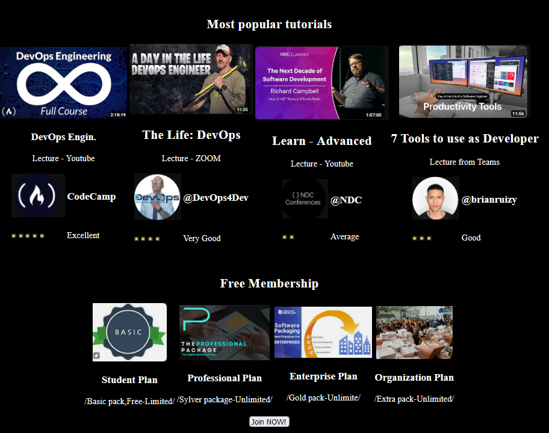
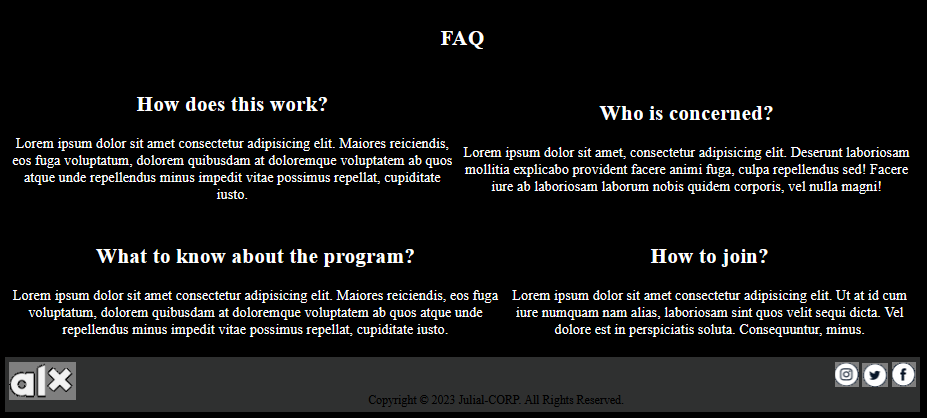

# HTML, advanced

## Resources

*Read or watch:*

   * Learn to Code HTML & CSS (until “Creating Lists” included)
   * Introduction to HTML
   * MDN

## Learning Objectives

At the end of this project, you are expected to be able to explain to anyone, without the help of Google:
General

   * What is HTML
   * How to create an HTML page from a wireframe
   * What is a markup language
   * What is the DOM
   * What is an element / tag
   * What is an attribute
   * What the purpose of each HTML tag

### MY RESULT NOT bad though !

#### THANK YOU !